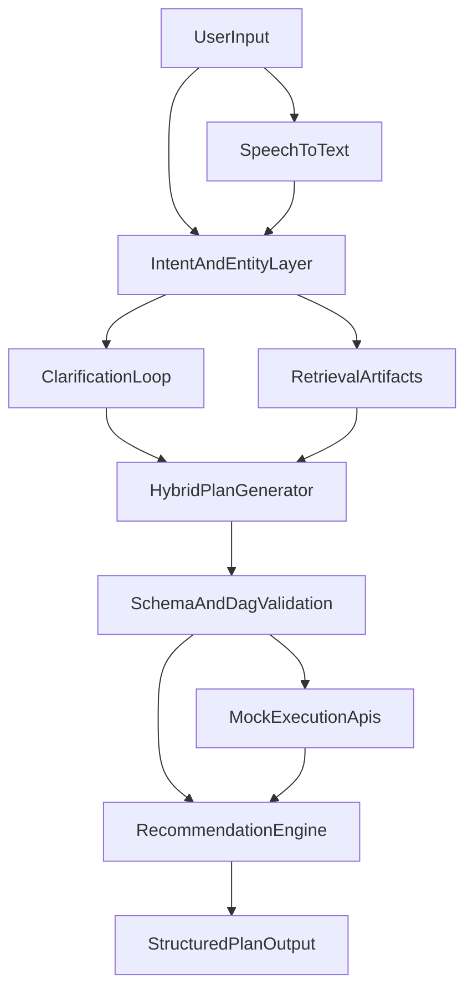

# AI Deployment Planner

Hybrid voice and text driven deployment flow planner with clarification questions, adaptive plan shaping, and structured execution output.

## Overview
`AI Deployment Planner` converts voice or text requests into structured deployment plans. The current version combines:
- text or voice input
- intent recognition
- entity extraction
- clarification questions when important details are missing or ambiguous
- adaptive plan shaping from retrieved example plans
- mocked internal execution APIs
- recommendations for next steps, risk reduction, and failure recovery

## How It Works
1. the user sends text or voice
2. voice is transcribed if needed
3. the system predicts intent and extracts entities
4. if the request is ambiguous or incomplete, the API returns clarification questions
5. after answers are provided, the planner builds a structured JSON plan
6. similar historical plan examples can influence the final group and task layout
7. dependency validation ensures the returned plan is consistent

## High-Level Architecture



## Current Version
Version `0.2.0` introduces a hybrid planning flow:
- deterministic templates remain as a safe fallback
- trained intent artifacts can be loaded at runtime
- retrieval artifacts can shape plan strategies and recommendations
- multi-turn clarification is supported through planning sessions

## Stack And Tools

### Core language
- `Python`

### Backend and API
- `FastAPI` for API routes and OpenAPI docs
- `Pydantic` for request, response, plan, and session schemas

### AI / ML and training
- `scikit-learn` for the current TF-IDF + Logistic Regression intent baseline
- `PyTorch` planned for future custom model training and fine-tuning
- `transformers` planned for richer NLP models
- `sentence-transformers` planned for stronger semantic retrieval
- `MLflow` for experiment tracking and artifact logging

### NLP and speech
- rule-based entity extraction in the current version
- `faster-whisper` for speech-to-text
- `Vosk` as an optional fallback ASR backend
- `spaCy` planned for richer entity extraction and normalization

### Planning and validation
- `NetworkX` for dependency graph validation and topological ordering
- deterministic fallback templates plus retrieval-guided plan shaping

### Recommendation and retrieval
- TF-IDF retrieval artifacts for similar plan and failure lookup
- troubleshooting knowledge base in markdown
- `FAISS` or `Chroma` planned for future vector retrieval

### Testing and development
- `pytest` for tests
- `httpx` for API testing
- `respx` available for HTTP mocking patterns
- `pip` for package management
- `Git` for version control

### Project artifacts and data
- `data/training/` stores source datasets
- `artifacts/intent/` stores trained intent artifacts
- `artifacts/recommendations/` stores trained retrieval artifacts
- `outputs/` stores quick-run API results

## Quick Start
Install dependencies:

```bash
pip install -e .[dev]
```

Start the API:

```bash
uvicorn src.api.main:app --reload
```

Run tests:

```bash
pytest
```

Run training:

```bash
python training/train_intent_model.py
python training/train_recommendation_model.py
```

Run the quick demo:

```bash
sh ./quick_run.sh
```

For voice input support:

```bash
pip install -e .[asr]
```

## Main API Endpoints
- `GET /health`
- `POST /plans/from-text`
- `POST /plans/from-voice`
- `POST /plans/sessions/{session_id}/answer`
- `GET /plans/{plan_id}`
- `POST /plans/{plan_id}/recommendations`
- `POST /mock/inventory/validate`
- `POST /mock/config/generate`
- `POST /mock/provision/infra`
- `POST /mock/provision/platform`
- `POST /mock/backup/enable`
- `POST /mock/verify/health`
- `POST /mock/rollback/start`

## Response Modes
`POST /plans/from-text` and `POST /plans/from-voice` can now return either:
- a final `DeploymentPlan`
- or a clarification response with `session_id`, `missing_fields`, and `questions`

After answering the questions with `POST /plans/sessions/{session_id}/answer`, the system returns the final plan.

## Output Files
When you run `sh ./quick_run.sh`, outputs are written to:
- `outputs/plan_response.json`
- `outputs/plan_saved.json`
- `outputs/recommendations.json`
- `outputs/server.log`
- `artifacts/intent/metrics.json`
- `artifacts/intent/metadata.json`
- `artifacts/intent/model.pkl`
- `artifacts/recommendations/metrics.json`
- `artifacts/recommendations/retrieval_index.pkl`

## Key Docs
- `TECHNOLOGY.md` - stack summary
- `TRAINING.md` - training and dataset flow
- `SAMPLES.md` - basic supported prompts
- `QUICK_SAMPLES.md` - fast copy-paste API tests
- `ADVANCED_SAMPLES.md` - clarification and dynamic planning scenarios
- `CHANGELOG.md` - version history and new behavior

## Why This Project Matters
This project demonstrates practical AI engineering beyond a simple chatbot. It translates user intent into actionable operational workflows while adding safety through schema validation, dependency checks, clarification loops, and retrieval-guided planning.
